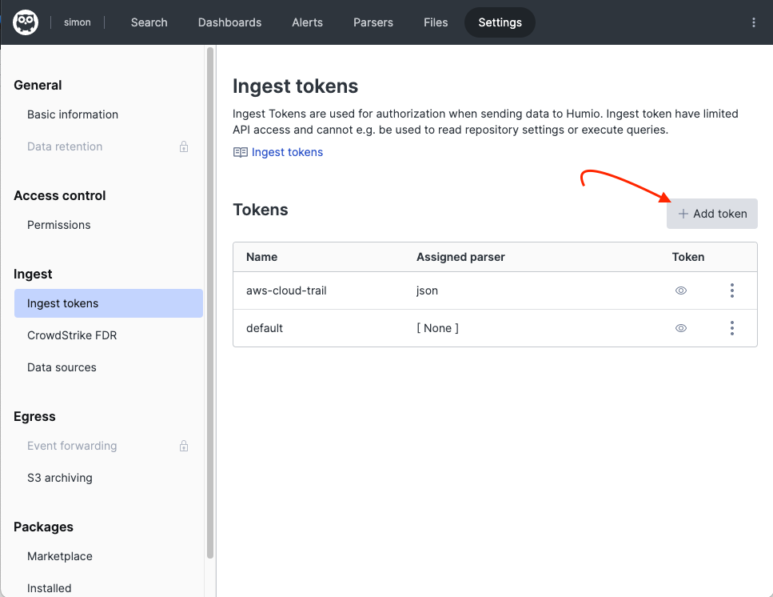
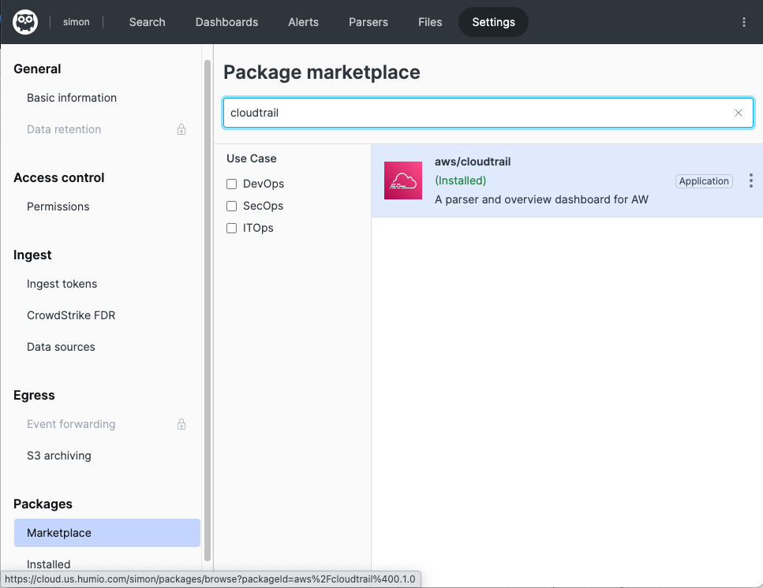
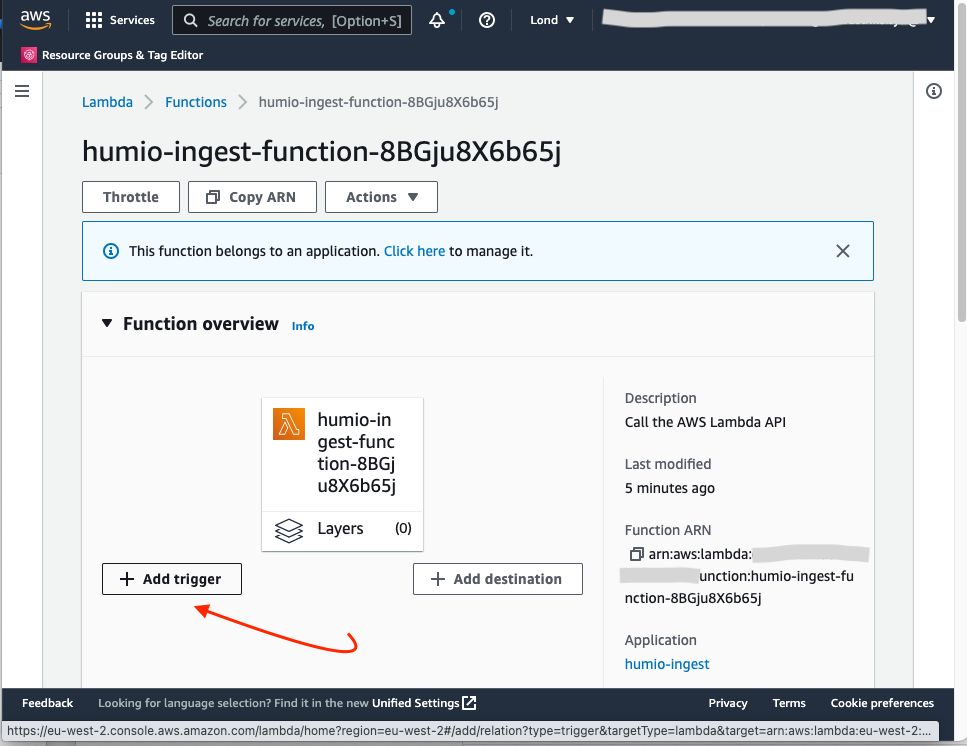
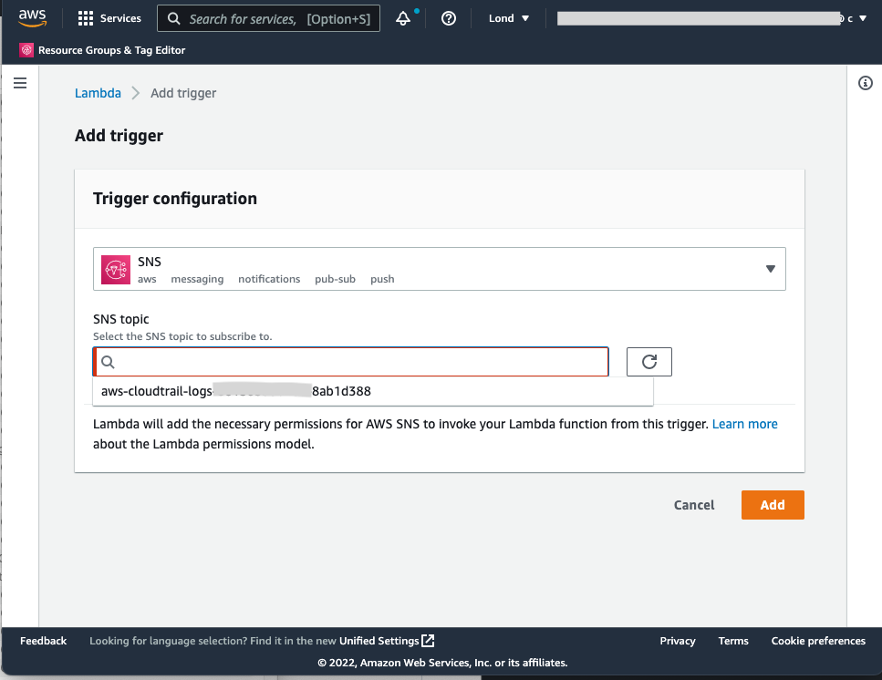

# Humio ingest from AWS Cloud Trail using AWS Lambda


 * *AWS Cloud Trail* records and tracks all application programing interface (API) requests in your AWS Account.
 * *Humio* is modern log management with streaming observability and affordable limited plans
 * This repo presents a lambda function to ingest data from AWS Cloud Trail to Humio

### Description of the solution

AWS CloudTrail can be configured to deliver logs to S3 bucket. Log files are typically delivered every 5 minutes. SNS notification is sent when new log appears in the S3 bucket. The notification triggers a run of lambda function. Lambda function then reads the said log file from S3 bucket, and sends its content to Humio.

### Deployment Steps

 - Log-in to Humio cloud or your Humio instance. Select (or create new) Humio Repository

   

 - Note Humio address and ingest token in environment variables
   ```shell
   export HUMIO_ADDRESS="https://cloud.us.humio.com/" # Replace with your cloud or instance fqdn
   export HUMIO_TOKEN="a1b2c3d4-1234-12a4-5678-91a23abc1234" # Replace with your own ingest token created above
   ```

 - (*optional*) Install CloudTrail package from Humio Marketplace

   

 - Create new [Cloud Trail](https://console.aws.amazon.com/cloudtrail/home#/configuration) with SNS notification delivery enabled

 - Create A AWS Lambda function [source code](./src)
   ```shell
   cd src
   ./1-create-bucket.sh
   ./2-deploy.sh
   ```

 - Create new notification from SNS to newly created lambda

   

   

 - Observe Humio dashboard being populated with AWS CloudTrail information

   
